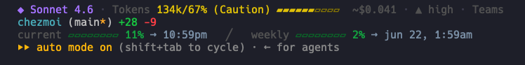

# ctxstat

Real-time context health for Claude Code. Know when you're in the smart zone — before you hit the dumb zone.


## Install

```sh
curl -fsSL https://raw.githubusercontent.com/vertocode/ctxstat/main/install.sh | bash
```

That's it. The installer downloads `statusline.sh`, makes it executable, and wires up `~/.claude/settings.json` automatically.

Start a Claude Code session — the statusline appears automatically.

## What it shows



**Row 1** — Model · Tokens/% (Zone) context bar · ~Cost · Effort · Plan

**Row 2** — Directory (branch\*) +additions -deletions

**Row 3** — Session duration · Session ID

**Row 4** — Rate limits: current and weekly bars with reset times (requires Claude.ai OAuth)

---

- **Model** — display name from Claude Code
- **Tokens / %** — context usage with visual bar, color-coded by zone
- **Zone** — Smart / Watch / Caution / Dumb
- **~Cost** — estimated input cost based on model pricing (Sonnet, Opus, Haiku, Fable)
- **Effort** — current effort level (▽ low / ◆ default / ▲ high)
- **Plan** — detected plan: Teams / Max / Pro / API
- **Git diff stat** — `+N -N` lines changed vs HEAD (green/red), only shown when in a git repo with changes
- **Session duration** — time since session start
- **Rate limits** — current (5h) and weekly bars with reset times (Claude.ai OAuth only)
- **Extra usage** — credit spending vs monthly limit (Max plan with overage enabled)

## Zones

| Zone    | Range   | Color  |
|---------|---------|--------|
| Smart   | 0–39%   | Green  |
| Watch   | 40–59%  | Orange |
| Caution | 60–79%  | Yellow |
| Dumb    | 80–100% | Red    |

## Requirements

- `bash` (macOS or Linux)
- `jq` — JSON parsing (`brew install jq` / `apt install jq`)
- `curl` — for rate limit and plan data (optional)
- Claude Code CLI

## Rate limits & plan

Rate limits and plan detection fetch from the Anthropic OAuth usage API. They appear automatically if you're logged in via Claude.ai OAuth. No API key needed.

Data is cached for 60 seconds in `/tmp/claude/ctxstat-cache.json`.

## Model compatibility

Works with any Claude Code session. Context window size comes directly from Claude Code's reported value — accurate across Sonnet, Opus, Haiku, Fable, and future models.

## Customization

Colors, thresholds, and zone names are defined in `statusline.sh`:

- `zone_color()` — ANSI color by zone name
- `zone_name()` — returns Smart / Watch / Caution / Dumb
- `session_cost()` — per-model pricing for cost estimate
- Bar width: `bw=8` in the rate limits section

## License

MIT
